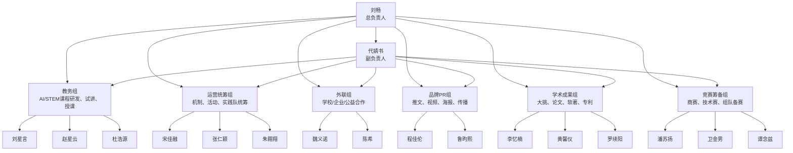

# 语冰组织架构图

```mermaid
flowchart TB
    A[刘畅\n总负责人] --> B[代婧书\n副负责人]
    A --> C[教务组\nAI/STEM课程研发、试讲、授课]
    A --> D[运营统筹组\n机制、活动、实践队统筹]
    A --> E[外联组\n学校/企业/公益合作]
    A --> F[品牌PR组\n推文、视频、海报、传播]
    A --> G[学术成果组\n大挑、论文、软著、专利]
    A --> H[竞赛筹备组\n商赛、技术赛、组队备赛]

    B --> C
    B --> D
    B --> E
    B --> F
    B --> G
    B --> H

    C --> C1[刘星言]
    C --> C2[赵星云]
    C --> C3[杜浩源]

    D --> D1[宋佳融]
    D --> D2[张仁颖]
    D --> D3[朱翱翔]

    E --> E1[魏义诺]
    E --> E2[陈希]

    F --> F1[程佳伦]
    F --> F2[鲁昀熙]

    G --> G1[李忆楠]
    G --> G2[黄馨仪]
    G --> G3[罗续阳]

    H --> H1[潘苏扬]
    H --> H2[卫金男]
    H --> H3[谭念兹]
```

## 说明

- 这是根据 2026-07-02 的《语冰·各部门职责与工作重点》整理的当前版本。
- 教务、运营、外联、PR、学术、竞赛为 6 个核心部门。
- 代婧书为副负责人，协助统筹各部门。
- 后续如果要做得更细，可以继续补“部门内分工版”和“任务流转版”。
