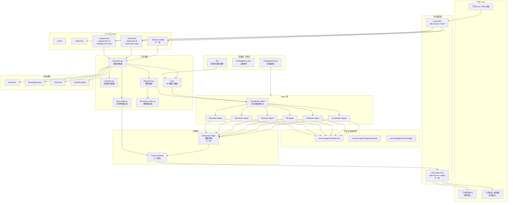

# 系统架构图（当前实现）



## 图例

- 实线箭头：当前已实现的数据流
- 带有"下一步"标注的节点：尚未实现，是正式 multi-agent 协作层的入口
- `Config` 层和 `Memory` 层都是本地文件，可人工编辑和调优

## 当前已实现的链路

```text
飞书文档
-> LarkClient (lark-cli docs +fetch)
-> document.py 选择规则或 AI
-> extractor + dispatcher / ai.py
-> Coordinator Agent 分派
-> task_drafts.py 生成任务草稿
-> Human Review 待确认
```

## 下一步要接的部分

```text
Coordinator Agent 分派
-> 部门 Agent 读取 profile + episodes + knowledge
-> 部门 Agent 独立增强任务草稿
-> Human Review 汇总审核
-> Lark Writer Tool (lark-cli task +create) 写入飞书任务
```

## 分层说明

| 层 | 职责 | 当前状态 |
|-|-|-|
| CLI | 用户入口 | 已实现 |
| 配置层 | 部门定义、模型配置 | 已实现，可调优 |
| 飞书适配层 | 读写飞书 | 读取已实现，写入下一步 |
| 工作流层 | 抽取、路由、草稿 | 已实现 |
| Agent 层 | 角色协作 | Coordinator 已实现，部门增强下一步 |
| 记忆层 | profile / episodes / knowledge | 骨架已实现，待积累 |
| 状态模型 | WorkItem / RoutingDecision / TaskDraft | 已实现 |
| 审核层 | 人工确认 | 草稿审核已实现，写入审核下一步 |
