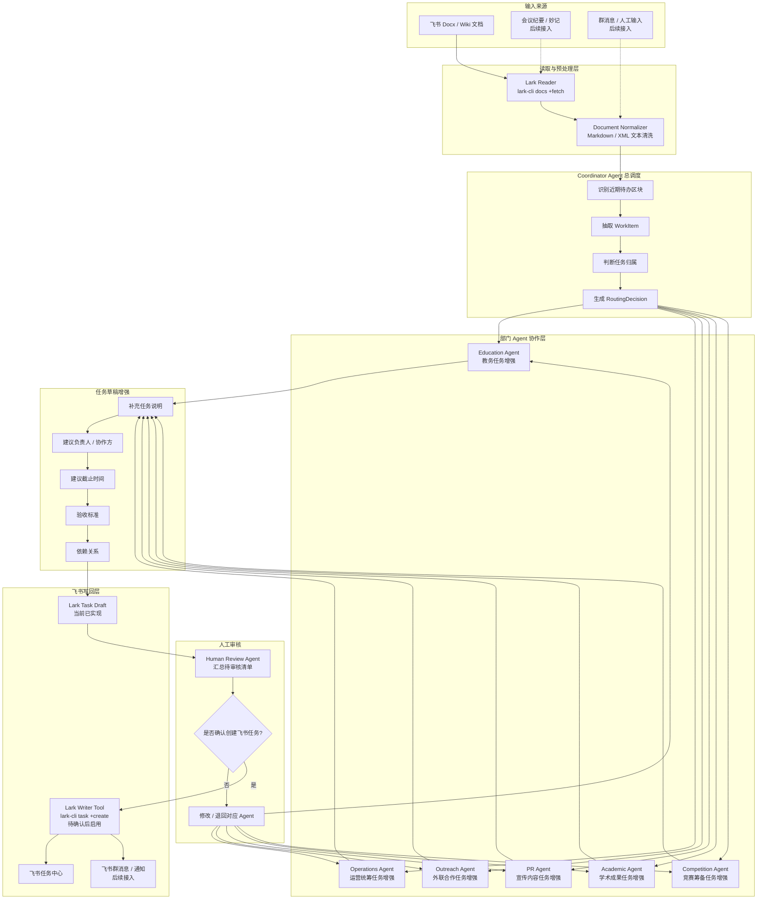

# 语冰任务流转版架构图

## 当前已实现

- `Lark Reader`：通过 `lark-cli docs +fetch` 读取飞书文档。
- `Coordinator Agent` 的基础能力：抽取待办、判断归属、生成路由结果。
- `Lark Task Draft`：把路由结果转换成 review-only 飞书任务草稿。
- `Human Review` 原则：所有写回飞书前都需要人工确认。

## 下一步正式 Multi-Agent 起点

正式 multi-agent 从“部门 Agent 协作层”开始：

1. Coordinator Agent 只负责拆分和分派，不再替各部门完善任务。
2. 每个部门 Agent 接收属于自己的任务草稿。
3. 部门 Agent 独立补充负责人建议、截止时间、验收标准和依赖关系。
4. Human Review Agent 汇总所有部门草稿。
5. 用户确认后，Lark Writer Tool 才调用 `lark-cli task +create`。

## 当前不做的事

- 不自动创建飞书任务。
- 不自动给成员分配任务。
- 不自动发送群通知。
- 不绕过人工审核。
